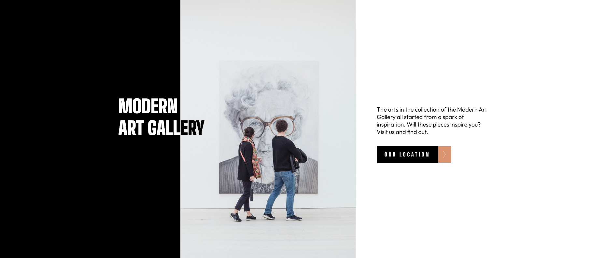

# Frontend Mentor - Art gallery website

## What I learned

- used class attribute selector to show and hide different viewport elements
- set variables in root
- use inline-block on inline elements when using padding
- i need to be careful putting margin-block on heading elements. it can mess up things later in the page. stick putting margin on images to break up sections.
- use width/height 100% and object fit cover to make grid img's repsonsive.
- i need to be mindful if SVG icons are to change color then mark them up appropriately. i need to stop being basic and using img tags all the time.
- use width: fit content to hug container to buttons

